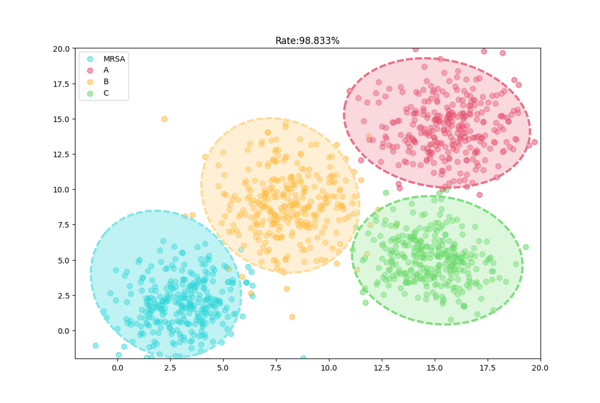

[中文](./CN.md)  /  [English](./README.md)

# 1.实现过程

## 1.1架构模型

### 1.1.1基于多分支注意力改进的卷积神经网络算法（MBAA-CNN）

​		MBAA-CNN架构体系分为两个主要阶段：第一阶段涉及基于多分支注意力网络层以及非局部自适应空间分割策略，第二阶段则采用卷积神经网络（CNN）实现多层次的空间谱特征提取。图示展现了MBAA-CNN在拉曼光谱数据分类中的应用结构。在初步阶段，预处理的光谱数据借助峰值检测算法进行非局部自适应分割，以划分出三个独立的数据区段，为后续分析奠定基础。随后，在MBAA-CNN内嵌的多分支注意力网络层作用下，系统自适应调整每个区段数据的权重，并动态整合多分支特征，为CNN的多层输入做好准备。第二阶段中，初步处理的数据分别输入CNN各分支的浅层、中层和深层，并经过卷积、池化、Dropout等一系列操作，以提炼出综合的空间-光谱特征。此后，通过Softmax层的作用最大化不同层间的互补信息的利用。最后，主分类器利用提取的特征完成测试样本的拉曼光谱分类。

	

​																			模型结构

​	

​	我们在训练网络时，为了使得模型可以更快更准确的训练，加入了学习率的自适应调整函数，可以根据训练的数据情况以及已有的训练量来自动调整学习率，使训练效果达到最优。

具体模型构架如下：	

1. 我们首先将训练数据集按照4：1划分成训练集与验证集。
2. 构建MBAA-CNN网络框架
3. 将训练数据输入MBAA-CNN网络进行10000轮训练
4. 待模型训练好后，使用测试数据测试模型预测结果
5. 调整模型参数，待模型结构最优后，测试模型最终的分类准确度，并记录训练期间 Loss 值的变动情况。


## 1.2基于注意力改进的卷积神经网络（MBAA-CNN）实验结果

训练结束后，本实验分别随机选取了3种细菌的50个拉曼数据进行模型评估。

### 1.2.1未标注数据混合

### 1.2.2标注数据混合（6种细菌训练与分类效果）

##### 1.训练准确率变化情况


准确率变化较为理想，满足预期要求：

- 在第1500轮训练后模型的**训练准确率**维持在98%左右
- 在第3400轮训练后模型的**验证准确率**维持在95%左右

```
	模型验证通常是在训练过程中使用一个独立于训练集和测试集的数据集进行模型性能评估。它可以用来检测模型是否过拟合或者欠拟合。如果模型在训练集上表现良好，但在验证集上表现较差，那就意味着模型可能过拟合了。这种情况下，可以采取一些方法如提前停止训练或增加正则化等来防止模型过拟合。

	训练准确率代表模型在当前训练数据上的表现。训练多轮后，训练准确率会逐渐提高，这表明模型学到了更多的数据分类特征。但是，如果训练准确率开始变得非常高，而验证准确率却不再提高，这说明模型开始过拟合训练数据。
```

##### 2.训练LOSS值变化情况


##### 3.模型分别对于n种细菌数据各自分类情况




##### 4.十种细菌同时分类情况

**（1）.未标注**


**（2）.标注**


##### 5.模型对于测试集的验证情况


##### 6.模型六种细菌的ROC变化情况


```
	ROC曲线可以帮助我们了解分类器在不同阈值下的表现情况，以及在不同的分类阈值下分类器的敏感性和特异性。曲线的横坐标是假正率（False Positive Rate）即被错误地分为正类的样本占所有负样本的比例，曲线的纵坐标是真正率（True Positive Rate）即被正确地分为正类的样本占所有正样本的比例，曲线越接近左上角，说明分类器的表现越好。
	通过ROC曲线我们可以判断分类器的性能是否足够好，同时也可以比较多个分类器的性能，选出最佳的分类器。
	举个例子如果ROC曲线下的面积（AUC）接近于1，则说明分类器的性能较好，如果ROC曲线下的面积接近于0.5，则说明分类器的性能不如随机猜测（随机猜测的AUC为0.5）。
```

### 1.2.3与经典网络相比的准确率提升程度


| Method   | 未标注 | 标注   |
| -------- | ------ | ------ |
| SVM      | 0.6981 | 0.7020 |
| RNN      | 0.8078 | 0.8104 |
| KNN      | 0.8567 | 0.8574 |
| CNN      | 0.9097 | 0.9187 |
| MBAA-CNN | 0.9897 | 0.9909 |


## 2.部署方法建议

- #### 提供测试使用预处理后的[十种细菌拉曼光谱test文件](https://drive.google.com/file/d/1WeH_uRzx1HT1DCyYilERKbZkCHOnwRav/view?usp=drive_link)，以及我们预训练好的[分类模型](https://drive.google.com/file/d/12Q4Vd-eN2-rNCBofm0dYQdozMhqTJg34/view?usp=drive_link)。使用时，请将test文件解压到Final_Data文件夹中并在Model_Apply.py中修改文件路径。对于原数据标签可以自行设置字典添加，例如：

```
['Cns', 'E. cloacae', 'E. coli', 'K. pneumoniae', 'MC', 'MRSA', 'MSSA', 'P. aeruginosa', 'P. vulgaris', 'S. epidermidi']
```

- 推荐使用Linux环境创建虚拟环境进行训练


使用请标明出处引用！

#### **参考：**

```
[1] J. Feng et al., "Attention Multibranch Convolutional Neural Network for Hyperspectral Image Classification Based on Adaptive Region Search," in IEEE Transactions on Geoscience and Remote Sensing, vol. 59, no. 6, pp. 5054-5070, June 2021, doi: 10.1109/TGRS.2020.3011943.

[2] Wang, Hongtao & Xu, Linfeng & Bezerianos, Anastasios & Chen, Chuangquan & Zhang, Zhiguo. (2020). Linking Attention-Based Multiscale CNN with Dynamical GCN for Driving Fatigue Detection. IEEE Transactions on Instrumentation and Measurement. 57. 1-1. 10.1109/TIM.2020.3047502. 

[3] Xunli Fan, Shixi Shan, Xianjun Li, Jinhang Li, Jizong Mi, Jian Yang, Yongqin Zhang,
Attention-modulated multi-branch convolutional neural networks for neonatal brain tissue segmentation,Computers in Biology and Medicine,Volume 146,2022,105522,ISSN 0010-4825,https://doi.org/10.1016/j.compbiomed.2022.105522.(这个论文没有下载入口，只参考了引言)

[4] H. Zhang, Y . Li, Y . Zhang, and Q. Shen, “Spectral-spatial classification
of hyperspectral imagery using a dual-channel convolutional neural
network,” Remote Sens. Lett., vol. 8, no. 5, pp. 438–447, May 2017.

[5] Y . Chen, H. Jiang, C. Li, X. Jia, and P. Ghamisi, “Deep feature extrac-
tion and classification of hyperspectral images based on convolutional
neural networks,” IEEE Trans. Geosci. Remote Sens., vol. 54, no. 10,
pp. 6232–6251, Oct. 2016.

[6] Y . Xu, L. Zhang, B. Du, and F. Zhang, “Spectral–spatial unified networks
for hyperspectral image classification,” IEEE Trans. Geosci. Remote
Sens., vol. 56, no. 10, pp. 5893–5909, Oct. 2018.

[7] Yin, Wenpeng, et al. "Comparative study of CNN and RNN for natural language processing." arXiv preprint arXiv:1702.01923 (2017).

[8] Visin, Francesco, et al. "Renet: A recurrent neural network based alternative to convolutional networks." arXiv preprint arXiv:1505.00393 (2015).

[9] Moldagulova, Aiman, and Rosnafisah Bte Sulaiman. "Using KNN algorithm for classification of textual documents." 2017 8th international conference on information technology (ICIT). IEEE, 2017.

[10] Chauhan, Rahul, Kamal Kumar Ghanshala, and R. C. Joshi. "Convolutional neural network (CNN) for image detection and recognition." 2018 first international conference on secure cyber computing and communication (ICSCCC). IEEE, 2018.

[11] Jakkula, Vikramaditya. "Tutorial on support vector machine (svm)." School of EECS, Washington State University 37.2.5 (2006): 3.

```

